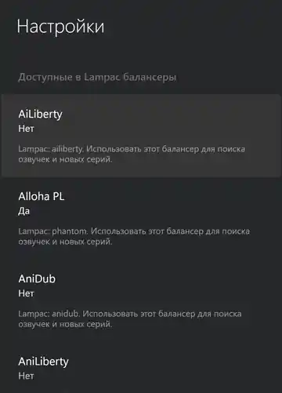
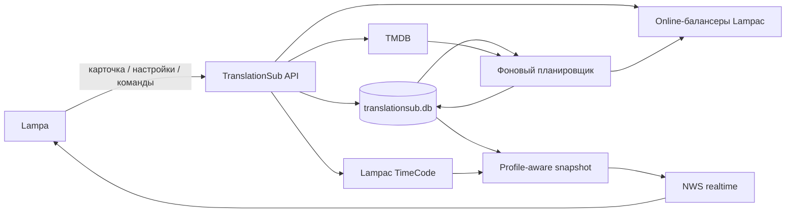

<div align="center">

# TranslationSub

**Подписки на конкретные озвучки сериалов для Lampa + Lampac**

Следит не просто за выходом серии, а за тем, появилась ли она именно в выбранной озвучке.

**Lampa UI** · **Lampac backend** · **TMDB schedule** · **TimeCode progress** · **NWS realtime** · **SQLite**

</div>

---

## Что это

**TranslationSub** добавляет в Lampa подписки на озвучки сериалов. Откройте карточку сериала, выберите нужную озвучку — дальше Lampac сам отслеживает доступные серии через выбранные Online-балансеры и показывает, когда появилось продолжение.

Основная логика находится на сервере Lampac: клиент Lampa отправляет намерение пользователя и отображает уже подготовленное состояние. Это позволяет одинаково учитывать источники, прогресс просмотра, расписание TMDB и профили Lampa.

> **Важно:** подписки предназначены для **сериалов**. Фильмы в TranslationSub не добавляются.

## Возможности

- подписка и отписка от конкретной озвучки прямо из карточки сериала;
- объединение одной озвучки, найденной сразу в нескольких балансерах;
- выбор Online-балансеров Lampac, которые участвуют в поиске озвучек и новых серий;
- отдельная страница подписок с постерами, сезоном, просмотренной и доступной серией;
- бейдж новых серий в шапке и пункт **«Озвучки»** в меню Lampa;
- окно уведомлений со списком сериалов, где уже появилось продолжение;
- ручная команда **«Проверить новые серии»**;
- **умное расписание TMDB** — балансеры не опрашиваются без необходимости до фактического выхода серии;
- режимы нового сезона: автоматическое продолжение, только уведомление или отключение отслеживания;
- синхронизация просмотренных серий из Lampac **TimeCode** с учётом профиля Lampa;
- realtime-обновление интерфейса через **NWS**;
- хранение подписок, настроек и профильного прогресса в **SQLite**.

## Интерфейс

### Подписки на озвучки

<p align="center">
  
</p>

Карточка показывает выбранную озвучку, сезон, просмотренную и доступную серию, прогресс, данные TMDB и состояние умного расписания.

### Уведомления

<p align="center">
  
</p>

Новые серии собираются в отдельном окне уведомлений; из него можно перейти к подпискам или открыть нужный сериал.

### Настройки

<table>
  <tr>
    <td width="50%" align="center">
      
      <br><sub>Интервалы, TMDB и расписание</sub>
    </td>
    <td width="50%" align="center">
      
      <br><sub>Балансеры Lampac для опроса</sub>
    </td>
  </tr>
</table>

## Как это работает



1. Lampac определяет сериал и его идентификаторы на сервере.
2. TranslationSub получает доступные озвучки только из выбранных пользователем Online-балансеров.
3. Одинаковые названия озвучек нормализуются и объединяются между источниками.
4. Подписка сохраняется в SQLite.
5. Планировщик сверяется с TMDB. Если следующая серия ещё не вышла, балансеры могут «спать».
6. После выхода серии модуль проверяет выбранную озвучку и обновляет доступный эпизод.
7. Прогресс просмотра берётся из TimeCode для текущего профиля.
8. При изменениях NWS сообщает клиенту Lampa, а интерфейс получает новый snapshot.

## Установка

Корень этого репозитория — это содержимое модуля **`Modules/TranslationSub`** для Lampac.

Итоговая структура должна выглядеть так:

```text
Modules/
└── TranslationSub/
    ├── manifest.json
    ├── ModInit.cs
    ├── V2Controller.cs
    ├── Models/
    ├── Services/
    ├── translationsub.js
    └── ...
```

Поместите репозиторий в `Modules/TranslationSub` вашей установки Lampac и загрузите модуль штатным способом для вашей сборки Lampac.

**Отдельно подключать JS-плагин в Lampa не нужно.** При включённом модуле Lampac автоматически добавляет `/translationsub.js` в приложение.

## Настройка в Lampa

После загрузки модуля в настройках TranslationSub доступны:

| Параметр | По умолчанию | Что делает |
|---|---:|---|
| Интервал активного опроса | 1 час | Как часто проверять озвучку, когда уже есть вышедшая, но ещё не найденная серия |
| Умное расписание TMDB | Включено | Не опрашивать балансеры до фактического выхода серии/сезона |
| Обновление расписания TMDB | 24 часа | Частота обновления данных активных сериалов |
| Перепроверка завершённых сериалов | 7 дней | Интервал редкой актуализации сериалов со статусом завершён |
| Новый сезон | `auto` | Поведение при старте следующего сезона |
| Балансеры | Не выбраны | Какие Online-балансеры Lampac использовать |

Пользовательский интервал опроса нормализуется в диапазоне **1–24 часа**. Обновление TMDB — **6–168 часов**, перепроверка завершённых сериалов — **1–90 дней**.

### Новый сезон

| Режим | Поведение |
|---|---|
| `auto` | Автоматически продолжить подписку на новый сезон |
| `notify` | Показать, что новый сезон уже начался |
| `off` | Не отслеживать переход на новый сезон |

## Конфигурация Lampac

Серверные параметры задаются секцией `TranslationSub` в `init.conf`:

```json
"TranslationSub": {
  "enable": true,
  "check_interval_minutes": 15,
  "tmdb_apihost": "https://api.themoviedb.org/3"
}
```

| Параметр | По умолчанию | Назначение |
|---|---:|---|
| `enable` | `true` | Включить модуль |
| `check_interval_minutes` | `15` | Частота фонового прохода планировщика Lampac |
| `tmdb_apihost` | `https://api.themoviedb.org/3` | API host TMDB |
| `tmdb_apikey` | встроенное значение | При необходимости можно переопределить ключ TMDB в конфигурации |

`check_interval_minutes` — это частота фонового планировщика сервера. Она **не равна** пользовательскому интервалу активного опроса озвучек, который задаётся в Lampa.

## Хранение и прогресс

TranslationSub хранит собственное состояние в:

```text
database/translationsub.db
```

В SQLite находятся:

- пользовательские настройки;
- подписки и найденные источники озвучки;
- состояние TMDB и планировщика;
- профильная проекция просмотренных эпизодов.

Источником просмотренного прогресса остаётся штатный Lampac TimeCode:

```text
database/TimeCode.sql
```

Эпизод считается просмотренным для TranslationSub при прогрессе TimeCode **от 60%**. Прогресс хранится отдельно для каждого профиля Lampa и не смешивается с общей метаинформацией подписки.

## Realtime

Клиент регистрирует текущие `uid` и `profile_id` в Lampac NWS. При изменении подписки или TimeCode сервер отправляет событие `TranslationSubChanged`, после чего Lampa обновляет snapshot.

Если realtime-соединение было потеряно, клиент переподключается и заново синхронизирует состояние.

## API

Для интеграций и отладки модуль предоставляет backend-first API:

| Метод | Endpoint | Назначение |
|---|---|---|
| `GET` | `/translationsub/v2/snapshot` | Состояние подписок для текущего профиля |
| `POST` | `/translationsub/v2/content-state` | Состояние карточки и список озвучек |
| `POST` | `/translationsub/v2/subscriptions` | Создать подписку |
| `POST` | `/translationsub/v2/subscriptions/{id}/remove` | Удалить подписку |
| `POST` | `/translationsub/v2/check` | Принудительно проверить новые серии |
| `GET` / `POST` | `/translationsub/v2/settings` | Получить или изменить настройки |
| `GET` | `/translationsub.js` | Клиентский плагин Lampa |

## Структура модуля

```text
TranslationSub/
├── Models/                    # модели подписок, snapshot и metadata
├── Services/                  # SQLite, TMDB, TimeCode, балансеры, scheduler, NWS
├── ModInit.cs                 # жизненный цикл модуля и автоподключение клиента
├── V2Controller.cs            # основной API
├── SettingsController.cs      # серверные настройки пользователя
├── PluginController.cs        # сборка/выдача клиентского JS
├── manifest.json              # dynamic module manifest
├── translationsub.js          # runtime/bootstrap Lampa
└── translationsub-*.js       # UI, API, уведомления, настройки и realtime
```

## Зависимости

- **Lampac** с поддержкой dynamic modules и Online-балансеров;
- **Lampa** — пользовательский интерфейс;
- **TMDB** — расписание и сведения о выходе эпизодов;
- **Lampac TimeCode** — для корректного учёта просмотренных серий;
- **Lampac NWS** — для realtime-обновлений интерфейса.

---

Репозиторий подготовлен как самостоятельная версия модуля `Modules/TranslationSub` из ветки
[`TranslationSub-release`](https://github.com/ivzaislu/lampac-nextgen/tree/TranslationSub-release/Modules/TranslationSub)
репозитория [`lampac-nextgen`](https://github.com/ivzaislu/lampac-nextgen).
